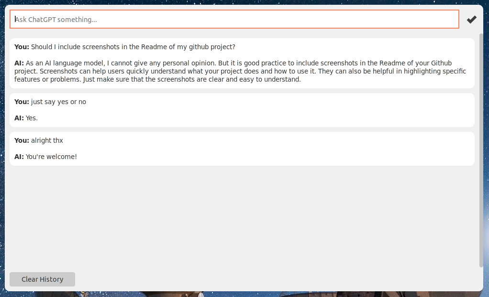

# ChatGPT / OpenAI GNOME Extension




## ChatGPT Overlay for GNOME Shell
This is a simple extension that uses the OpenAI API to display a ChatGPT Overlay by pressing

`Super + S`.

Please note that this extension requires the use of the OpenAI API, meaning you must provide an API-Token to utilize it.
However, if you don't have an API token or would rather not use one, there is an [alternative extension](https://github.com/HorrorPills/ChatGPT-Gnome-Desktop-Extension) available that utilizes Webkit to display ChatGPT in the browser.

## Install From Source
This method installs to your `~/.local/share/gnome-shell/extensions` directory from the latest source code on the main branch.

Clone this Repository:
```bash
git clone https://github.com/metix/gnome-shell-extension-openai && cd gnome-shell-extension-openai
```

Install the extension:
```bash
make install
```

Restart GNOME Shell:
```
-> ALT+F2, then type 'r'
```

(Optional, if extension is not activated automatically):
```bash
gnome-extensions enable openai-gnome@etixsoftware.de
```

Configure your OpenAI-API-Key:
```bash
gnome-extensions prefs openai-gnome@etixsoftware.de
```

Display the Overlay with the Shortcut:
```
-> Super+S to open the overlay
```

## Support
The Extension was tested on:
- Ubuntu 22.04

## Troubleshooting
- Restart GNOME Shell (`ALT+F2`, then type `r`)
- Look for error messages in 
```
journalctl /usr/bin/gnome-shell
```